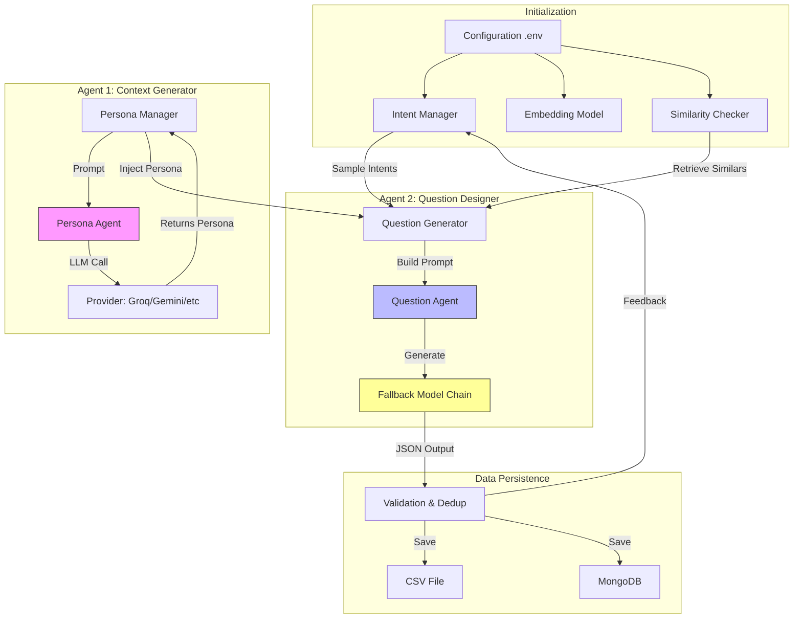
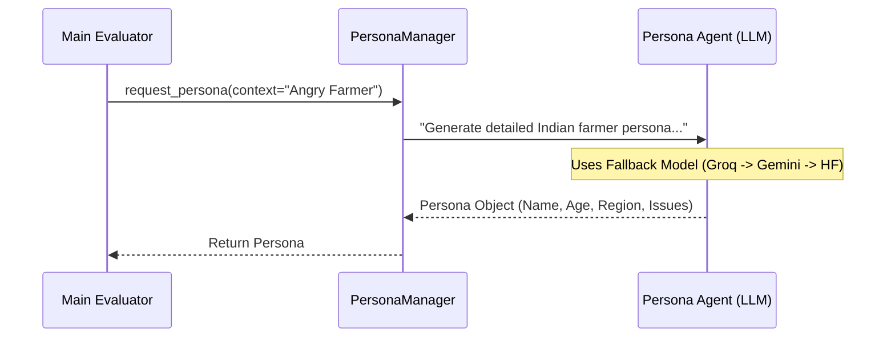
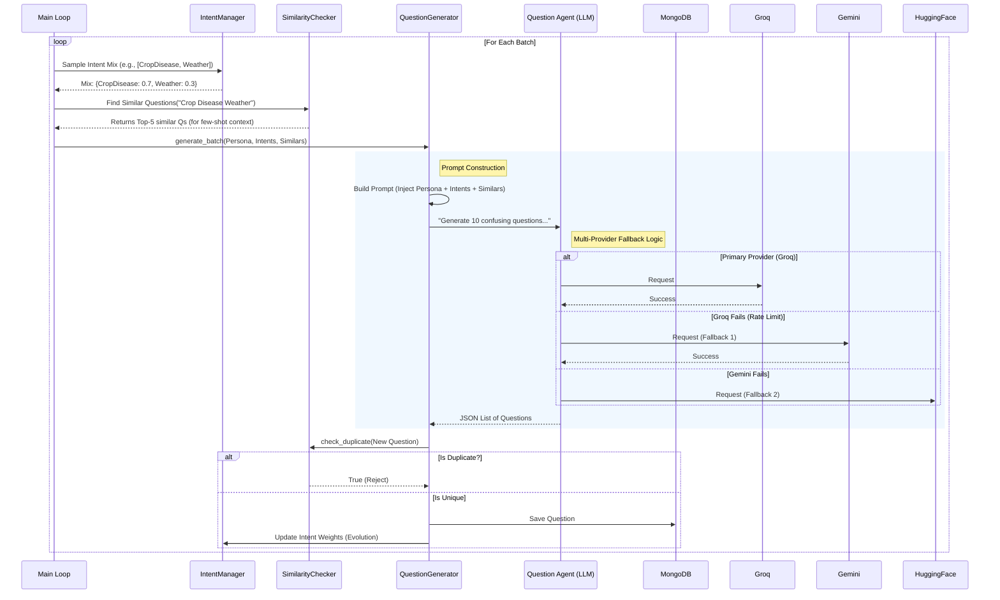
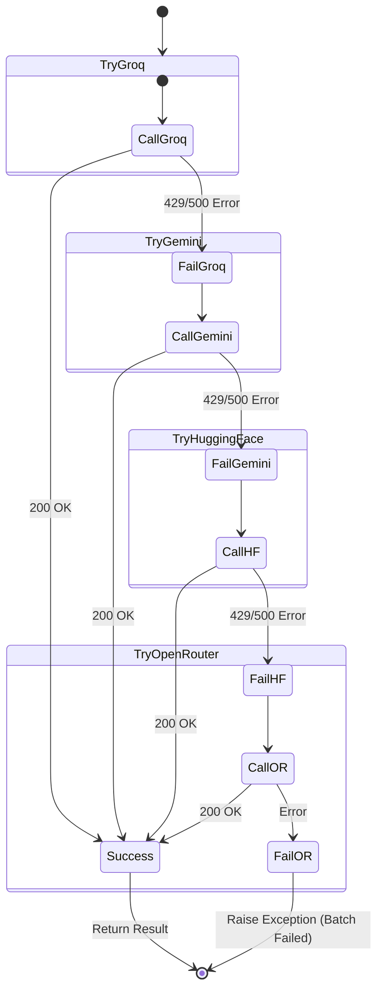

# Agentic Flow Architecture

This document outlines the multi-agent architecture and execution flow for the Intent-Based Question Generator.

## High-Level System Architecture

The system operates as a **Multi-Agent Orchestration** where `main.py` coordinates specialized agents and managers to produce high-quality, diverse questions.

---

## Detailed Agent Execution Flow

The core logic revolves around two distinct agentic workflows:

### 1. Persona Generation Flow (Agent 1)
This agent's sole responsibility is to create realistic "User Profiles" (Personas) to ensure diversity.

### 2. Question Generation Flow (Agent 2)
This is the primary agent that designs the questions based on the context provided by Agent 1 and the Intent Logic.

## Multi-Provider Fallback Mechanism

The generic "Agent" wrapper implements a robust fallback mechanism to ensure high availability and rate-limit handling.

